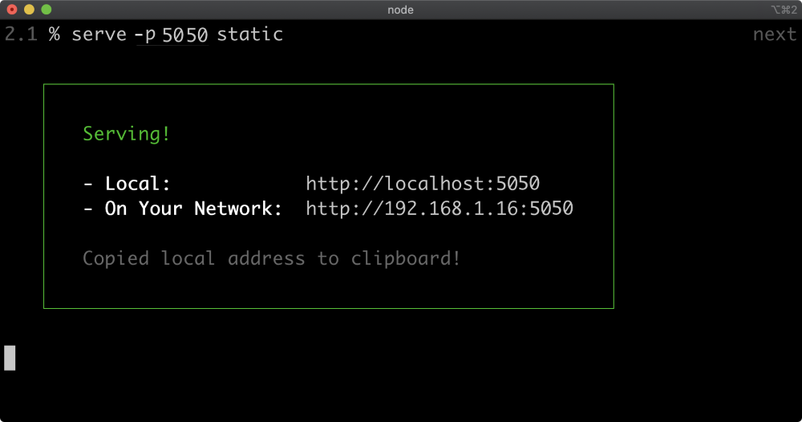
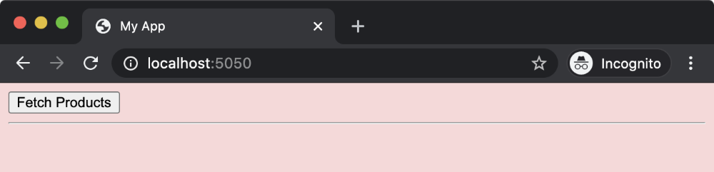
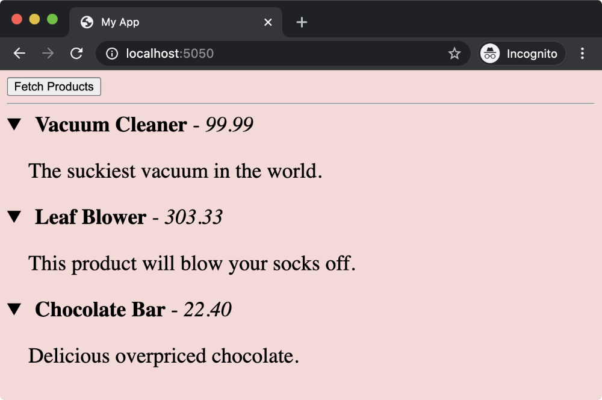

# 02. Setting Up

## Come non installare Node.js

Spesso Node.js viene installato tramite il package manager del sistema operativo, come apt-get su Debian/Ubuntu, brew su macOS o chocolatey su Windows.
Tuttavia, questa modalità è sconsigliata, per diversi motivi:

### Problemi principali

Versioni obsolete
I package manager spesso non seguono il ritmo delle nuove versioni di Node.js. Questo può portare a:

- Funzionalità mancanti
- Bug non risolti
- Patch di sicurezza assenti

#### Percorsi non standardizzati

I file binari e di configurazione possono trovarsi in posizioni diverse a seconda del sistema operativo e del gestore di pacchetti, creando confusione e problemi di compatibilità.

#### Uso di sudo per installare pacchetti globali

Su sistemi non-Windows, per installare moduli globali con npm, è necessario usare sudo, cosa non raccomandata per motivi di sicurezza.

### Soluzione consigliata

È preferibile non installare Node.js tramite package manager né scaricandolo direttamente dal sito ufficiale (su macOS/Linux richiede comunque sudo).

La soluzione migliore è usare un version manager, che verrà spiegata nelle prossime sezioni.

#### Prima di procedere...

Se hai già installato Node.js tramite un package manager o direttamente dal sito ufficiale, è fortemente consigliato disinstallarlo completamente prima di continuare.

## Installare Node.js con FNM (Fast Node Manager)

In questa sezione vedremo come installare Node.js utilizzando un version manager chiamato FNM (Fast Node Manager), compatibile con Windows, macOS e Linux.

Anche se i sistemi operativi offrono metodi nativi per installare Node, raccomandiamo l’uso di FNM per un processo più semplice, veloce e flessibile.

## Cos'è FNM?

Un gestore di versioni Node.js leggero e veloce.

Permette di installare, disinstallare e passare automaticamente tra versioni diverse in base alla directory corrente.

Compatibile con shell popolari: bash, zsh, fish, PowerShell e cmd.

Supporta file .node-version e .nvmrc.

Documentazione completa: https://github.com/Schniz/fnm

## File .nvmrc

Per "fissare" una versione specifica di Node.js nel tuo progetto, devi creare un file .nvmrc nella cartella principale del progetto. Questo file indica a Node.js e al package manager quale versione di Node usare.

### Come creare e usare il file .nvmrc:

1. Apri un editor di testo nella cartella principale del progetto.
2. Crea un nuovo file e salvalo con il nome .nvmrc (incluso il punto iniziale).
3. Scrivi all’interno la versione di Node desiderata, ad esempio:
   ```bash
   v18.16.0
   ```
   (puoi trovare la versione giusta sul sito ufficiale di Node.js, scegliendo la versione LTS o l’ultima disponibile).
4. Salva e chiudi il file.

### Per installare e usare la versione specificata nel progetto:

```bash
fnm use --version-file-strategy local
```

Questo comando legge la versione indicata nel .nvmrc, la installa se necessario e la imposta come versione attiva per quel progetto.

#### Consiglio importante:

Condividi sempre il file .nvmrc nel repository del progetto, così tutti i collaboratori useranno la stessa versione di Node.js.

---

# 03. Service Mocking

## Panoramica del Capitolo

Nel lavoro professionale, la capacità di creare rapidamente web service mock con dati simulati, eseguibili in locale, è una competenza molto utile.

### Perché creare servizi mock?

- Accesso limitato o assente a servizi reali, perché:
  - Non sono ancora stati creati
  - Hanno prestazioni lente o sono inattivi
  - Ci sono problemi di permessi
- Ambienti di staging condivisi tra team, che possono causare risultati imprevisti se un altro sviluppatore modifica lo stato condiviso.

### Vantaggi dei servizi mock:

- Possibilità di far girare copie locali dei servizi di produzione con uno stato indipendente.
- Facilitare il prototipaggio rapido, soprattutto quando lo sviluppo client-side definisce il modello dati.

### Cosa vedremo in questo capitolo

Impareremo a creare servizi mock in modo rapido ed efficiente usando Node.js.

## Obiettivi di Apprendimento

Al termine di questo capitolo sarai in grado di:

- Creare un server di file locale con il minimo sforzo.
- Realizzare un servizio mock molto semplice usando solo le funzionalità base di Node.js.
- Spiegare come creare rapidamente la struttura di un servizio Fastify per mock più complessi.

## Avviare un Progetto Node.js

Per iniziare un progetto Node.js, è necessario creare un file package.json, che funge da manifesto per le dipendenze e i metadati del progetto. Questo file è fondamentale per la gestione del progetto.

### Come creare package.json

Nel terminale, esegui il comando:

```bash
npm init
```

Verranno richieste alcune informazioni come:

- Nome del progetto (es. my-node-project)
- Versione (es. 1.0.0)
- Descrizione (es. Un progetto di esempio Node.js)
- File di ingresso (es. index.js)
- Autore (es. John Doe)
- Licenza (es. MIT)

Dopo aver risposto alle domande, il comando genera il file package.json nella cartella corrente, contenente i dati inseriti.

### Perché è importante?

Il file package.json permette di:

- Gestire le dipendenze del progetto
- Definire script per eseguire attività specifiche
- Fornire informazioni di base sul progetto

## Quick File Server (1)

Per servire file da una cartella, possiamo utilizzare il pacchetto serve.

### Installazione

Nel terminale, esegui:

```bash
npm install serve
```

### Creazione cartella statica

Crea una nuova cartella chiamata static nella directory del progetto:

```bash
mkdir static
```

Puoi usare qualsiasi metodo preferito per creare la cartella static.

## Quick File Server (2)

Il secondo passo è creare due file index.html e app.js dentro la cartella static. Inserisci il codice indicato in ciascun file.

### File `index.html`

```html
<html>
  <head>
    <title>My App</title>
    <script type="module" src="app.js"></script>
    <style>
      body {
        background: #fad8d8;
      }
    </style>
  </head>
  <body>
    <nav>
      <button id="fetch">Fetch Products</button>
    </nav>
    <hr />
    <div id="products"></div>
    <template id="item">
      <style>
        details {
          font-size: 1.5em;
        }
        summary {
          cursor: pointer;
        }
        p {
          text-indent: 1.5rem;
        }
      </style>
      <details>
        <summary>
          <strong>
            <slot name="name"></slot>
          </strong>
          - <em><slot name="rrp"></slot></em>
        </summary>
        <p><slot name="info"></slot></p>
      </details>
    </template>
  </body>
</html>
```

### File `app.js`

```javascript
const mockData = [
  {
    id: "A1",
    name: "Vacuum Cleaner",
    rrp: "99.99",
    info: "The most powerful vacuum in the world.",
  },
  {
    id: "A2",
    name: "Leaf Blower",
    rrp: "303.33",
    info: "This product will blow your socks off.",
  },
  {
    id: "B1",
    name: "Chocolate Bar",
    rrp: "22.40",
    info: "Deliciously overpriced chocolate.",
  },
];

const populateProducts = () => {
  const products = document.querySelector("#products");
  products.innerHTML = "";
  for (const product of mockData) {
    const item = document.createElement("product-item");
    for (const key of ["name", "rrp", "info"]) {
      const span = document.createElement("span");
      span.slot = key;
      span.textContent = product[key];
      item.appendChild(span);
    }
    products.appendChild(item);
  }
};

document.querySelector("#fetch").addEventListener("click", async () => {
  await populateProducts();
});

customElements.define(
  "product-item",
  class Item extends HTMLElement {
    constructor() {
      super();
      const itemTmpl = document.querySelector("#item").content.cloneNode(true);
      this.attachShadow({ mode: "open" }).appendChild(itemTmpl);
    }
  }
);
```

Con questi file, il pulsante "Fetch Products" popolerà la pagina con i dati mock dei prodotti.

## Quick File Server (3)

### Avvio del server

1. Apri il terminale e naviga nella cartella che contiene la cartella static.
2. Avvia il server con questo comando:

```bash
npx serve -p 5050 static
```

Questo comando avvierà un file server sulla porta 5050, servendo il contenuto della cartella static.



### Verifica nel browser

- Apri il browser e vai all’indirizzo:
  http://localhost:5050
- Dovresti vedere la pagina web con il pulsante Fetch Products.



### Funzionamento

- Cliccando sul pulsante Fetch Products, la pagina si popolerà con i dati mock dei prodotti.
- Ogni sezione può essere espansa per visualizzare i dettagli di ciascun prodotto.



## Quick File Server - Riepilogo

In questa sezione abbiamo:

- Installato il pacchetto serve.
- Creato una cartella static con i file `index.html` e `app.js`.
- Avviato un server locale con il comando:
  ```bash
  npx serve -p 5050 static
  ```

Questo ci ha permesso di aprire l'app nel browser all’indirizzo: http://localhost:5050
Cliccando sul pulsante "Fetch Products", vengono visualizzati dei dati mock definiti nel file `app.js`.
